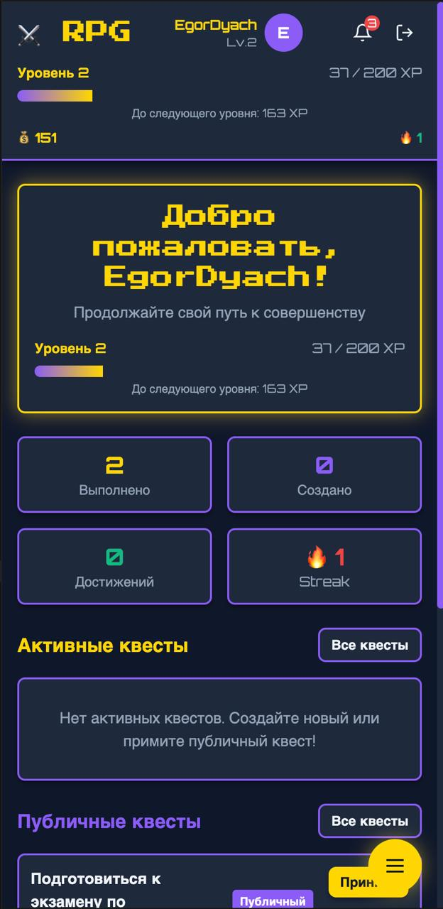
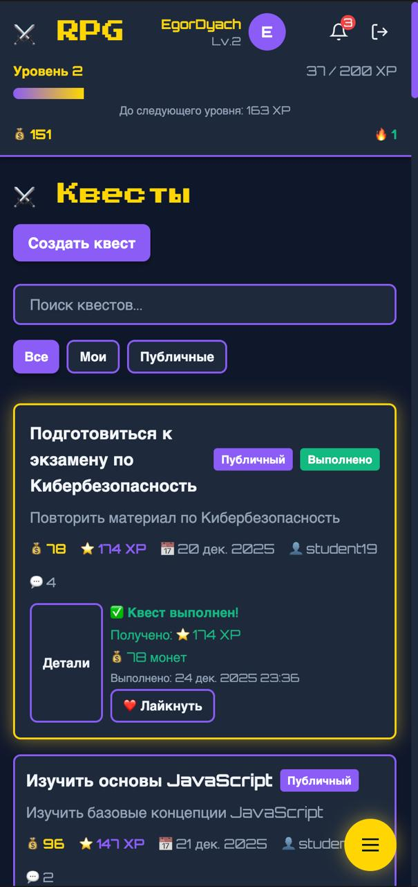
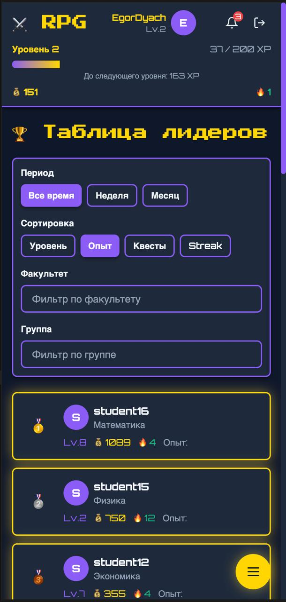
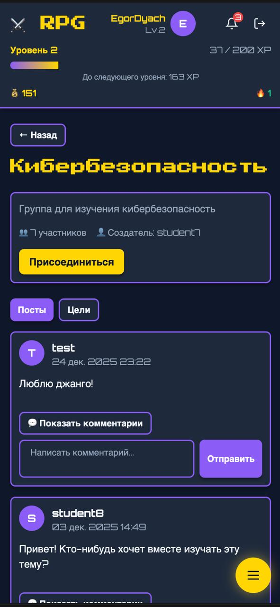
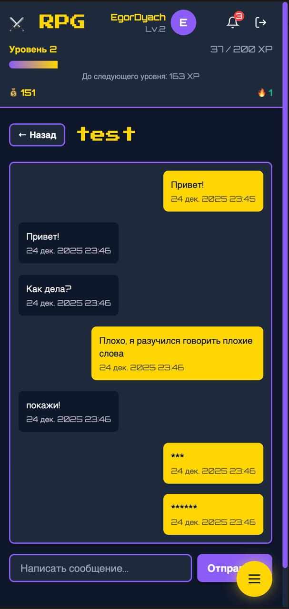
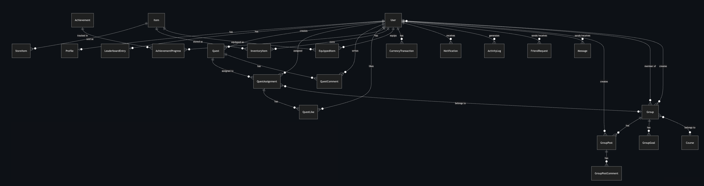
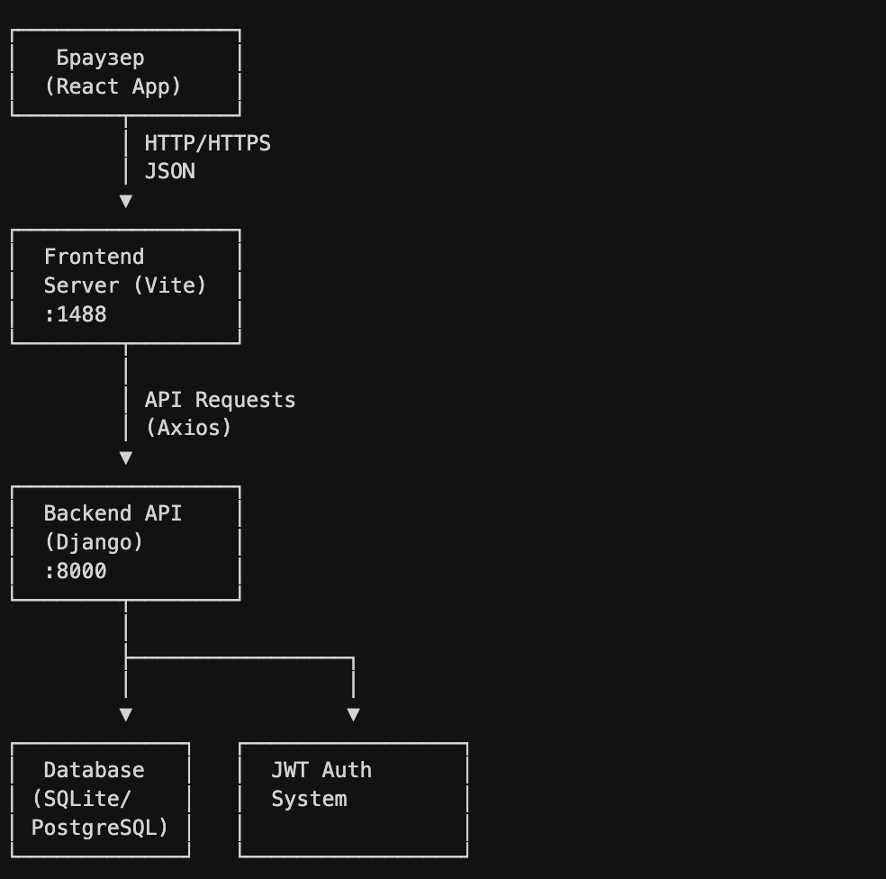

# RPG Quest — Система геймификации саморазвития для студентов

RPG Quest — это веб-приложение для мотивации студентов к саморазвитию через игровые механики. Система позволяет студентам создавать и выполнять квесты, получать опыт и монеты, соревноваться в рейтингах, объединяться в группы и получать достижения за активность.

Проект реализован как fullstack приложение с разделением на backend (Django REST API) и frontend (React + TypeScript). Backend предоставляет RESTful API с JWT аутентификацией, автоматическим начислением наград, системой достижений и социальными функциями. Frontend представляет собой современное одностраничное приложение с игровым дизайном, оптимизированное для мобильных устройств.

## Features

- **Система квестов** — создание личных и публичных квестов с настройкой сложности, дедлайнов и наград
- **Прокачка персонажа** — система уровней с автоматическим повышением при накоплении опыта
- **Достижения** — автоматическая проверка и начисление достижений за различные активности
- **Таблица лидеров** — рейтинги по уровню, опыту, количеству квестов и streak с фильтрами по периоду, факультету и группе
- **Группы (гильдии)** — создание групп для совместной работы, посты и комментарии, групповые цели
- **Социальное взаимодействие** — комментарии к квестам, лайки выполненных заданий, личные сообщения, заявки в друзья
- **Магазин и инвентарь** — система предметов с возможностью покупки и экипировки
- **Уведомления** — автоматические уведомления о новых квестах, достижениях, повышении уровня и социальных событиях
- **Streak система** — отслеживание серии дней активности без пропусков
- **Фильтрация контента** — автоматическая фильтрация нецензурных слов в пользовательском контенте

## Tech Stack

### Backend

- **Python 3.9+** — язык программирования
- **Django 4.2+** — веб-фреймворк
- **Django REST Framework** — для создания REST API
- **djangorestframework-simplejwt** — JWT аутентификация
- **drf-spectacular** — генерация OpenAPI/Swagger документации
- **django-cors-headers** — обработка CORS запросов
- **psycopg2-binary** — драйвер PostgreSQL
- **python-dotenv** — управление переменными окружения
- **SQLite/PostgreSQL** — база данных (SQLite для разработки, PostgreSQL для продакшена)

### Frontend

- **React 18** — UI библиотека
- **TypeScript** — типизация
- **Vite** — сборщик и dev-сервер
- **React Router** — маршрутизация
- **Axios** — HTTP клиент для API запросов
- **Tailwind CSS** — utility-first CSS фреймворк
- **React Hot Toast** — уведомления

### Инфраструктура

- **Docker** — контейнеризация (опционально)
- **Git** — система контроля версий

## Installation

### Предварительные требования

- Python 3.9 или выше
- Node.js 16+ и npm
- Git

### Установка Backend

1. **Клонирование репозитория:**

```bash
git clone <repository-url>
cd rpg/rpg-backend
```

2. **Создание виртуального окружения:**

```bash
python3 -m venv venv
source venv/bin/activate  # На Windows: venv\Scripts\activate
```

3. **Установка зависимостей:**

```bash
pip install -r requirements.txt
```

4. **Настройка переменных окружения:**
   Создайте файл `.env` в папке `rpg-backend`:

```env
SECRET_KEY=your-secret-key-here
DEBUG=True
DATABASE_URL=sqlite:///db.sqlite3
```

5. **Применение миграций:**

```bash
python manage.py migrate
```

6. **Создание суперпользователя (опционально):**

```bash
python manage.py createsuperuser
```

7. **Генерация тестовых данных (опционально):**

```bash
python manage.py generate_mock_data
```

8. **Запуск сервера:**

```bash
python manage.py runserver
```

Backend будет доступен на `http://localhost:8000`

### Установка Frontend

1. **Переход в папку frontend:**

```bash
cd ../rpg-frontend
```

2. **Установка зависимостей:**

```bash
npm install
```

3. **Настройка переменных окружения (опционально):**
   Создайте файл `.env`:

```env
VITE_API_URL=http://localhost:8000/api
```

4. **Запуск dev-сервера:**

```bash
npm run dev
```

Frontend будет доступен на `http://localhost:1488`

### Использование Docker (опционально)

Для запуска с PostgreSQL через Docker:

```bash
cd rpg-backend
docker-compose up -d
python manage.py migrate
python manage.py runserver
```

## Screenshots

### Главная страница с активными квестами


_Главная страница приложения с отображением активных квестов пользователя_

### Страница квестов


_Страница квестов с настройкой параметров_

### Таблица лидеров


_Рейтинг пользователей с фильтрами по периоду и параметрам сортировки_

### Группы (гильдии)


_Страница групп с постами и возможностью создания новых групп_

### Чаты


_Страница чатов, на которых можно общаться с друзьями (фильтрация плохих слов)_

## API Documentation

Проект использует Django REST Framework с автоматической генерацией OpenAPI документации через drf-spectacular.

### Доступ к документации

После запуска backend сервера доступны:

- **Swagger UI**: http://localhost:8000/api/docs/
- **ReDoc**: http://localhost:8000/api/redoc/
- **Schema JSON**: http://localhost:8000/api/schema/

### Основные эндпоинты

#### Аутентификация

- `POST /api/users/` — Регистрация нового пользователя
- `POST /api/token/` — Получение JWT токена (access + refresh)
- `POST /api/token/refresh/` — Обновление access токена
- `GET /api/users/me/` — Получение данных текущего пользователя
- `GET /api/users/stats/` — Статистика текущего пользователя

#### Квесты

- `GET /api/quests/` — Список квестов (публичные + свои)
- `POST /api/quests/` — Создать новый квест
- `GET /api/quests/{id}/` — Детали квеста
- `POST /api/quests/{id}/accept/` — Принять публичный квест
- `GET /api/assignments/` — Мои назначенные квесты
- `POST /api/assignments/{id}/complete/` — Выполнить квест

#### Группы

- `GET /api/groups/` — Список групп
- `POST /api/groups/` — Создать группу
- `POST /api/groups/{id}/join/` — Присоединиться к группе
- `POST /api/groups/{id}/leave/` — Покинуть группу
- `GET /api/group-posts/?group={id}` — Посты группы
- `POST /api/group-posts/` — Создать пост в группе

#### Рейтинги

- `GET /api/leaderboard/rankings/?period={all|week|month}&sort_by={level|xp|quests|streak}&faculty={name}&group_name={name}` — Рейтинг пользователей

#### Достижения

- `GET /api/achievements/` — Список всех достижений
- `GET /api/achievement-progress/` — Прогресс по достижениям текущего пользователя

#### Уведомления

- `GET /api/notifications/` — Мои уведомления
- `PATCH /api/notifications/{id}/` — Отметить уведомление как прочитанное

#### Магазин и инвентарь

- `GET /api/store-items/` — Предметы в магазине
- `POST /api/store-items/{id}/purchase/` — Купить предмет
- `GET /api/inventory/` — Мой инвентарь
- `POST /api/equipped/` — Экипировать предмет

#### Социальные функции

- `GET /api/quest-comments/?quest={id}` — Комментарии к квесту
- `POST /api/quest-comments/` — Добавить комментарий
- `POST /api/quest-likes/` — Лайкнуть выполненный квест
- `GET /api/friend-requests/` — Заявки в друзья
- `POST /api/friend-requests/` — Отправить заявку в друзья
- `GET /api/messages/` — Личные сообщения

### Примеры запросов

#### Регистрация

```bash
curl -X POST http://localhost:8000/api/users/ \
  -H "Content-Type: application/json" \
  -d '{
    "username": "student1",
    "email": "student1@example.com",
    "password": "password123",
    "role": "student",
    "faculty": "ИТ",
    "group_name": "ИВТ-21"
  }'
```

#### Получение токена

```bash
curl -X POST http://localhost:8000/api/token/ \
  -H "Content-Type: application/json" \
  -d '{
    "username": "student1",
    "password": "password123"
  }'
```

#### Создание квеста

```bash
curl -X POST http://localhost:8000/api/quests/ \
  -H "Authorization: Bearer YOUR_ACCESS_TOKEN" \
  -H "Content-Type: application/json" \
  -d '{
    "title": "Изучить Django REST Framework",
    "description": "Пройти курс по DRF",
    "goal": "Создать API для проекта",
    "is_public": true,
    "xp_reward": 100,
    "coin_reward": 50,
    "deadline": "2024-12-31T23:59:59Z",
    "difficulty": 3
  }'
```

## ER-диаграмма базы данных



Полное описание сущностей базы данных доступно в файле [DATABASE_ENTITIES.md](rpg-backend/DATABASE_ENTITIES.md)

### Основные сущности

- **User** — пользователи системы (студенты и администраторы)
- **Profile** — расширенная информация о пользователе
- **Quest** — квесты (личные и публичные)
- **QuestAssignment** — назначения квестов пользователям
- **Group** — группы пользователей
- **Achievement** — достижения
- **AchievementProgress** — прогресс по достижениям
- **Item** — предметы в системе
- **StoreItem** — предметы в магазине
- **InventoryItem** — инвентарь пользователя
- **Notification** — уведомления
- **LeaderboardEntry** — записи рейтинга

## Архитектурная схема



### Компоненты системы

1. **Браузер/Клиент** — React приложение, отправляет HTTP запросы к API
2. **Frontend Server (Vite)** — dev-сервер для разработки, в продакшене — статические файлы
3. **Backend API (Django)** — REST API сервер, обрабатывает запросы, бизнес-логику
4. **Database (SQLite/PostgreSQL)** — хранение данных
5. **JWT Authentication** — система аутентификации через токены

### Поток данных

1. Пользователь взаимодействует с React приложением
2. Frontend отправляет HTTP запросы к Django API
3. Django обрабатывает запрос, проверяет аутентификацию (JWT)
4. Выполняется бизнес-логика (начисление XP, проверка достижений)
5. Данные сохраняются/читаются из базы данных
6. Ответ возвращается в формате JSON
7. Frontend обновляет UI на основе полученных данных

### Особенности архитектуры

- **RESTful API** — стандартизированный интерфейс для взаимодействия
- **JWT токены** — stateless аутентификация
- **Автоматические процессы** — начисление наград, проверка достижений происходят автоматически
- **Сигналы Django** — автоматическое создание профиля при регистрации
- **CORS** — поддержка кросс-доменных запросов

## Дополнительная документация

- [Backend README](rpg-backend/readme.md) — подробная документация backend API
- [Frontend README](rpg-frontend/README.md) — документация frontend приложения
- [Database Entities](rpg-backend/DATABASE_ENTITIES.md) — описание сущностей базы данных

## Лицензия

MIT
