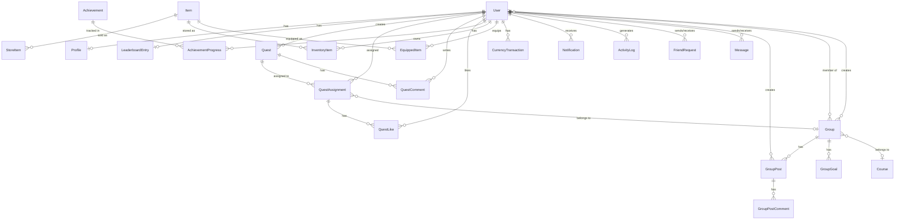

# ER-диаграмма базы данных RPG Quest

## Диаграмма связей

## Описание связей

### User (Пользователь)
- **OneToOne** → Profile
- **OneToOne** → LeaderboardEntry
- **OneToMany** → Quest (created_by)
- **OneToMany** → Group (created_by)
- **ManyToMany** → Group (members)
- **OneToMany** → QuestAssignment
- **OneToMany** → QuestComment
- **OneToMany** → QuestLike
- **OneToMany** → AchievementProgress
- **OneToMany** → InventoryItem
- **OneToMany** → EquippedItem
- **OneToMany** → CurrencyTransaction
- **OneToMany** → Notification
- **OneToMany** → ActivityLog
- **OneToMany** → FriendRequest (from_user/to_user)
- **OneToMany** → Message (sender/receiver)
- **OneToMany** → GroupPost

### Quest (Квест)
- **ManyToOne** → User (created_by)
- **OneToMany** → QuestAssignment
- **OneToMany** → QuestComment

### QuestAssignment (Назначение квеста)
- **ManyToOne** → Quest
- **ManyToOne** → User
- **ManyToOne** → Group (optional)
- **OneToMany** → QuestLike

### Group (Группа)
- **ManyToOne** → Course (optional)
- **ManyToOne** → User (created_by)
- **ManyToMany** → User (members)
- **OneToMany** → QuestAssignment
- **OneToMany** → GroupPost
- **OneToMany** → GroupGoal

### Achievement (Достижение)
- **OneToMany** → AchievementProgress

### Item (Предмет)
- **OneToMany** → StoreItem
- **OneToMany** → InventoryItem
- **OneToMany** → EquippedItem

## Ключевые индексы

- `User`: `[-xp, -coins]`, `[-level]`
- `Quest`: `[is_daily, difficulty]`, `[is_public, created_by]`
- `QuestAssignment`: `[user, is_completed]`
- `StoreItem`: `[price]`
- `CurrencyTransaction`: `[user, -created_at]`
- `LeaderboardEntry`: `[-score]`

## Уникальные ограничения

- `User.username` — уникальный
- `User.email` — уникальный
- `QuestAssignment`: `(quest, user, due_date)` — уникальная комбинация
- `QuestLike`: `(quest_assignment, user)` — один лайк на задание
- `AchievementProgress`: `(achievement, user)` — один прогресс на достижение
- `InventoryItem`: `(user, item)` — один тип предмета на пользователя
- `EquippedItem`: `(user, slot)` — один предмет на слот
- `FriendRequest`: `(from_user, to_user)` — одна заявка между пользователями
- `Group`: `(name, course)` — уникальная комбинация

